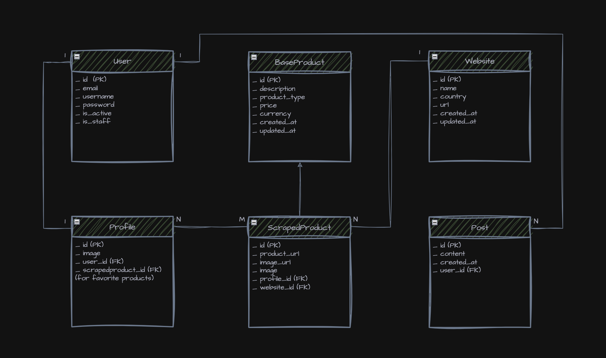

## Project: Price Comparison Website - Django 

  

  <a href="https://fromsifr.com" style="color: #23c483;>fromsifr.com</a>

 
### Table of contents:
1. Project description
2. Features
3. Technology Stack 
4. Web Scraping
5. Django application
6. Deployment
7. SEO considerations

## 1. Project description:
This project is a price comparison web application MVP (Minimum Viable Product) focused on the 
niche of smartwatches. It is primarily intended for users in Egypt. I aimed to create a 
comprehensive project, particularly in terms of backend development. The main goal was to practice
and explore Python and Django, allowing me to learn new libraries and tools while improving my 
skills as a developer. This project consists of two main parts:
* **Web Scraping**
* **Django Application**

## 2. Features:

* **Multilingual Support**: The application is available in both **English** and **Arabic**
* **Price comparison**: Users can click on the product image to display detailed product 
information (such as description, price, etc.) without leaving the page. The application features
a minimalist user interface, allowing users to view prices for multiple smartwatches 
simultaneously and facilitating easy comparisons.
* **Search Bar**: Users can search for specific products by color, brand, or other criteria.
* **Access the store**: Users can easily navigate to the original store of the scraped product 
with a dedicated button, enabling them to view more details and complete their purchase seamlessly.

* **Authentication**:
    * Website authentication
    * Google account integration
* **Favorites**:  Authenticated users can add specific products to their favorites and remove 
them as needed.
* **Product recommendations**: For each smartwatch, users can view the five closest products 
based on descriptions.
* **Feed/posts**: In this first version, the feed feature is designed to be simple. Authenticated
users can write posts to leave feedback, suggest features, or share anything related to their 
experience. These posts will be publicly visible, allowing other users to view and engage with the
content. This feature empowers users to provide their insights and opinions, facilitating iterative
improvements based on user suggestions.
* **Responsive Design**: The application features a responsive design, ensuring a seamless user 
experience across various devices, including desktops, tablets, and smartphones.

## 3. Technology Stack:

### Frontend technologies: 
* HTML
* CSS
* Javascript
### Backend technologies: 
* Programming Language: 
  * **Python**
* Web Framework:
  * **Django**
* Database:
  * **PostgreSQL**
* Caching (in-memory):
  * **Redis**
* Testing (Unit tests):
  * **Pytest** 
* Application Server:
  * **Gunicorn**
* Web Server / Reverse Proxy:
  * **Nginx** 
* DevOps tools:
  * **Gitlab CI/CD**
  * **Docker**
  * **Docker Compose**
* Cloud services:
   * **A.W.S** - Amazon Web Services: 
     - **EC2**: Elastic Compute Cloud
     - **SSM** Parameter: Systems Manager
     - **S3**: Simple Storage Service
     - **RDS**: Relational Database Service
     - **SES**: Simple Email Service
     - **Route 53**: **D**omain **N**ame **S**ystem service
     
### Machine-Learning:

* **scikit-learn**: TfidfVectorizer, cosine_similarity

A bit of machine learning has been implemented in this project to compute vectors from product
descriptions, enabling the identification of the five closest products for each item. 
This is accomplished using `TfidfVectorizer`, which transforms text descriptions into numerical 
vectors based on term frequency-inverse document frequency (TF-IDF) scores. 
We then utilize `cosine_similarity` to measure the similarity between these vectors, 
allowing us to pinpoint the most similar products based on their descriptions.
Then, I have cached the IDs of the product recommendations for improved performance.

## 4. Web Scraping:
* **Scraper**:
In this first version, I have scraped products from four Egyptian websites:
  * Amazon Egypt
  * Jumia Egypt
  * 2B
  * EhabGroup

  For each product, I collected the following information: image, price, description, currency, and
  product URL. I used `asyncio` and `aiohttp` to fetch data asynchronously from each page, and 
  `BeautifulSoup` to parse HTML content.

* **Data Normalization**: 
 I implemented helper functions using `Python` and `Pandas` to normalize the scraped data.

* **Data Storing**: Before creating Django instances and storing them in the database, I first 
**saved the products asynchronously in CSV files** (in both English and Arabic) using `aiofiles` 
while they were being fetched.

* **Unique Index Creation**: 
Since the products were stored in two CSV files for both languages but not in the same order 
(due to asynchronous processing), I created a unique index in each CSV file using `Pandas`. 
This step ensured a proper correspondence between the two files, allowing me to instantiate 
the models correctly in English and Arabic using `django-parler`.
## 5. Django Application:
This section provides an overview of the key features and components implemented in the 
Django application:

* **Applications**:
    * **Product**: contains the `Website`, `BaseProduct`, and `ScrapedProduct` models.  This structure
      supports future extensions through **inheritance**, such as implementing a buy/sell feature 
      with additional **derived classes**.
    * **User**: contains the `CustomUser`, `CustomUserManager`, and `Profile` models. 
      The CustomUserManager class **overrides** BaseUserManager to allow sign-in with email and password. 
      The CustomUser model permits authentication using either email or username. The Profile model
      adds additional user-related fields without overloading CustomUser, ensuring better
      organization and reusability.
    * **Feed**: includes the `Post` model for user feedback.  

* **Signals**: Django signals are used in the user application to automatically create a user 
profile whenever a new user instance is generated.
* **Multilingual Support**: `django-parler` third-party library for ScrapedProduct
models. Additionally, I utilized Django's built-in internationalization (`i18n`) feature to 
translate the content of `django-allauth` templates.
* **Forms**: The user application includes a `CustomSignupForm`, and the `PostCreateView` handles 
post submissions.
* **Unit Tests**: I used the `Pytest` testing framework (**fixtures**, **parameterization**, ...) to write unit tests covering all aspects
of the Django application, including models, views, URLs, and templates.
* **Validators**: custom validators for checking email addresses and usernames during the sign-up
process.
* **Views**: concerning the views, I used both **class-based and function-based views** depending 
on the specific requirements and features of the application.
* **Pagination**: to manage the display of large datasets, enhancing user navigation 
and performance, using the **paginate_by** attribute.
* **Django ORM QuerySets**: querysets are used to manipulate data before displaying it 
(filtering, sorting, etc.), allowing for efficient retrieval of relevant data entries based on various conditions.
  

## 6. Deployment:
This section outlines the main steps and elements involved in deploying the Django application:

* **settings**: settings are modularized to support different environments, including testing, 
development, and **production**.
* **Docker**: the Django application is Dockerized using a **Dockerfile** to ensure environment 
consistency, simplify deployment, and enable smooth integration with the CI/CD pipeline.
* **Gunicorn**: acts as the **WSGI HTTP server** to run the Django application, utilizing Django’s WSGI
application to ensure efficient and reliable handling of HTTP requests in a production environment.
* **Nginx**: serves as a reverse proxy, handling client requests and serving static files to 
improve application performance and security; it also supports load balancing when configured.
* **Docker Compose**: is used to **orchestrate** the web service (Django with Gunicorn) 
and the Nginx service, managing them in a coordinated environment.
* **CI/CD pipeline**: I configured a CI/CD (Continuous Integration/Continuous Deployment) pipeline
in `GitLab` to automate **Quality** checks, **Testing**, **Building** the Docker image, and 
**Deploying** to an AWS EC2 instance using the docker-compose.yml file.
* **AWS** : I utilized an EC2 instance to host the Django app with Docker Compose, S3 for media file
storage, RDS for the PostgreSQL database, SES for transactional email sending, SSM Parameter Store
for environment variables, and Route 53 for domain management.

## 7. SEO considerations:
* **Meta Tags**: Added relevant meta tags to improve search engine indexing and visibility.
* **Manual Translation**: Translated the website content myself to ensure accuracy and better 
alignment with the target audience, rather than relying on automated translation tools like 
Google Translate.
* **Optimized URLs**: Ensured that URLs are clean, descriptive, and contain relevant keywords.
* **Responsive Design**: Implemented responsive design to enhance user experience across devices.

---